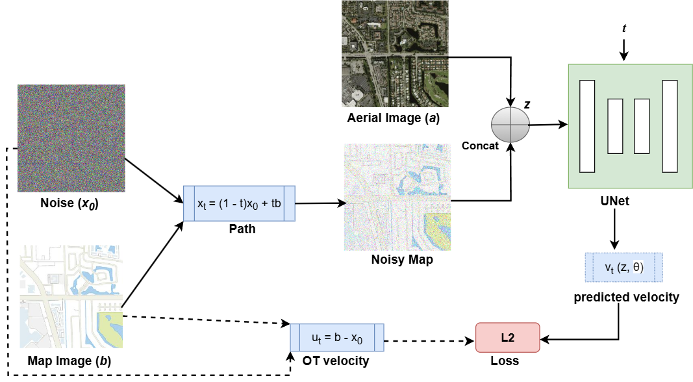

# Flow Matching for Vector Map Generation from Aerial Imagery
PairFlow

<p align="center">
 
</p>

## Code
Official implementation of the paper: "Flow Matching for Vector Map Generation from Aerial Imagery"

## Installation
- Clone the repository:
   ```bash
   git clone https://github.com/xxxxx/PairFlow.git
   cd PairFlow
   ```
- Create a Python virtual environment (optional)
  ```bash
   python -m venv myvenv
   source myvenv/bin/activate
  ```
- Train the PairFlow:
```bash
CUDA_VISIBLE_DEVICES=1,2,3,4 \
torchrun --standalone --nproc_per_node=4 --master_port=xxxxx \
train.py --epochs 400 --batch_size batch_size --lr 2e-4 --eval_interval eval_interval --no_fid
```
Note: Remove no_fid, if fid computation is desired.

## Dataset
The Terra_Aerial_Map dataset will be made public soon.
