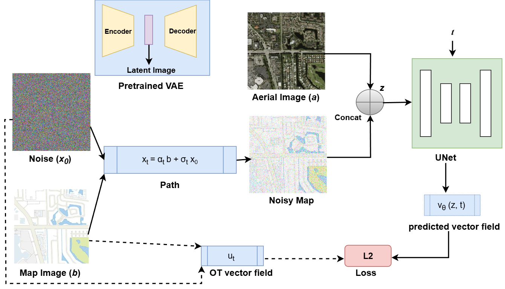

# PairFlow: Efficient Flow Matching for Paired Image-to-Image Translation with Perceptual and Structural Fidelity


<p align="center">
 
</p>

## Code
Official implementation of the paper: "PairFlow: Efficient Flow Matching for Paired Image-to-Image Translation with Perceptual and Structural Fidelity"

## Installation
- Clone the repository:
   ```bash
   git clone https://github.com/amaha7984/PairFlow.git
   cd PairFlow
   ```
- Create a Python virtual environment (optional)
  ```bash
   python -m venv myvenv
   source myvenv/bin/activate
  ```
- Train the PairFlow:
```bash
CUDA_VISIBLE_DEVICES=1,2,3,4 \
torchrun --standalone --nproc_per_node=4 --master_port=xxxxx \
train.py --epochs 400 --batch_size batch_size --lr 2e-4 --eval_interval eval_interval --no_fid
```
Note: Remove no_fid, if fid computation is desired.
- Inference (Translate Aerial to Vector Maps):
```bash
CUDA_VISIBLE_DEVICES=1,2,3,4 torchrun --standalone --nproc_per_node=4 --master_port xxxxx \
  inference.py \
  --weights /path/to/saved/model \
  --sat_dir "/path/to/aerial_imagery" \
  --nfe 50 \
  --schedule cosine \
  --epoch_tag epoch_num \
  --batch_size 32 \
  --gen_dir /path/to/save/translated/vector_maps \
  --chunk_size 256
```  

## Dataset
The Terra_Aerial_Map dataset will be made public soon.

### Citation

If you find this repository useful for your research, please consider citing our work:

```bibtex
@InProceedings{Mahara_2026_CVPRW,
    author    = {Mahara, Arpan and Rishe, Naphtali},
    title     = {PairFlow: Efficient Flow Matching for Paired Image-to-Image Translation with Perceptual and Structural Fidelity},
    booktitle = {Proceedings of the IEEE/CVF Conference on Computer Vision and Pattern Recognition (CVPR) Workshops},
    year      = {2026},
    note      = {In press}
}
